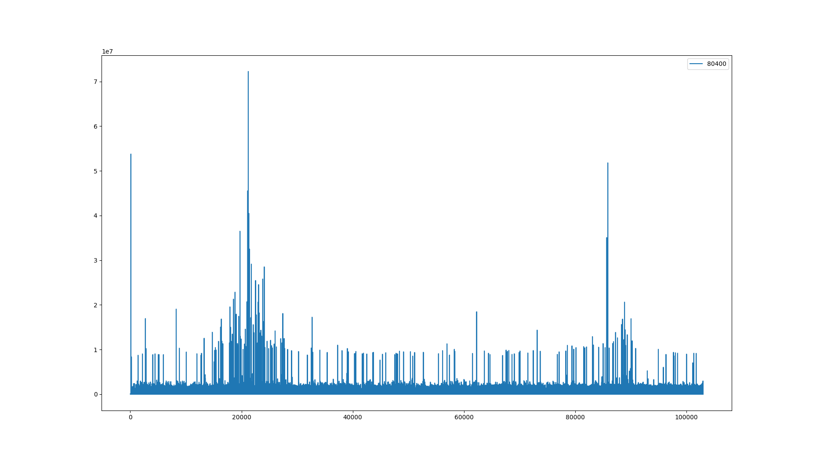
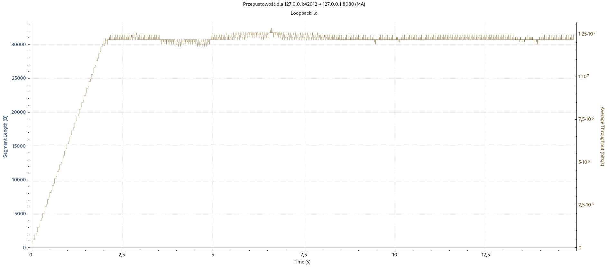
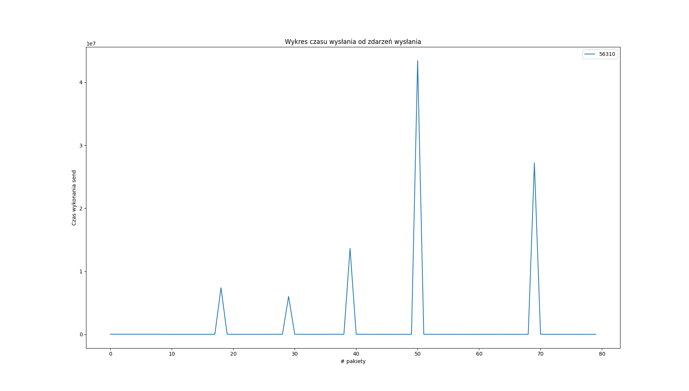
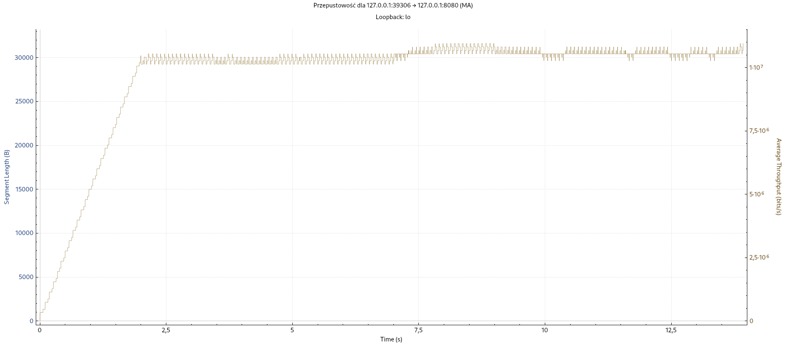
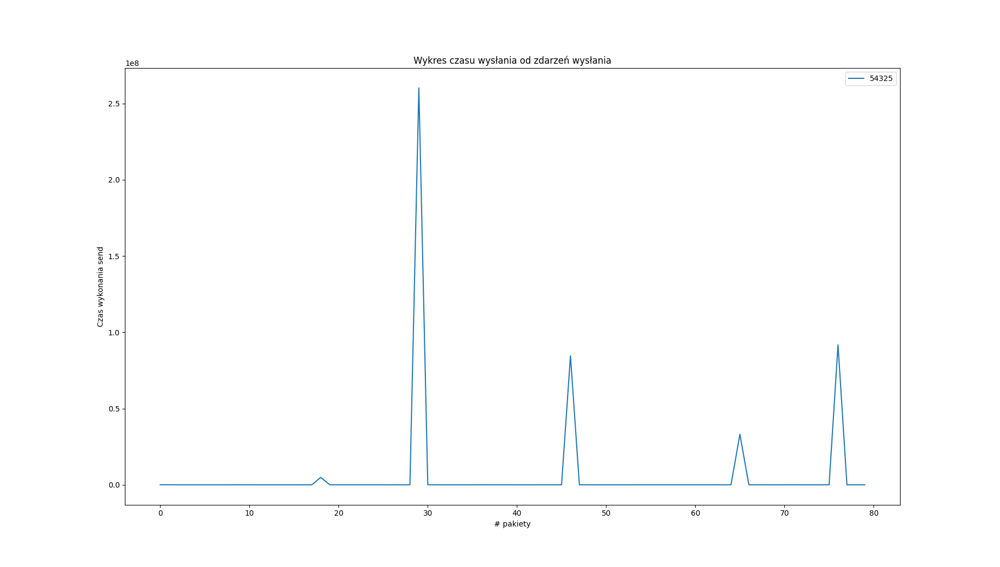
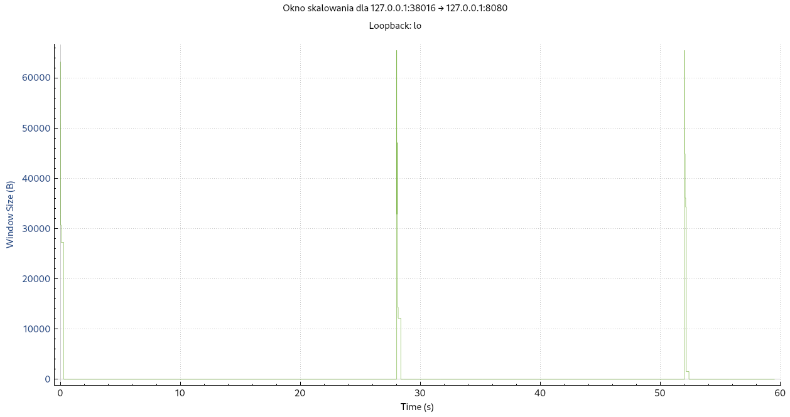
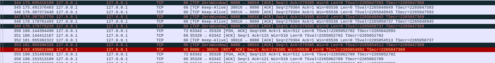

## Komunikacja TCP

Kaszyński Dawid, Jakub Jażdżyk, Mikołaj Szawerda, Wojciech Zarzecki

---

## Polecenie

Napisać zestaw programów - klienta i serwera - komunikujących się poprzez TCP.
1. Napisać klient/serwer przesyłające między sobą złożoną strukturę danych
2. Napisać modyfikację 1. posługującą się IPv6
3. Zbadać wpływ zmiany rozmiaru bufora nadawczego

## Zad 2.1

### Zapis i odczyt złożonej struktury danych

```c
void read_from_buffer(int connfd)
{
    char buff[BUFF_SIZE];

    bzero(buff, BUFF_SIZE);
    read(connfd, buff, sizeof(buff));


    Node *head = NULL;
    Node *current = NULL;
    int i = 0;
    int nodes_count = 0;
    while (nodes_count < NODES_COUNT) {
        if (head == NULL) {
            head = (Node *)malloc(sizeof(Node));
            current = head;
        } else {
            current->next = (Node *)malloc(sizeof(Node));
            current = current->next;
        }
        current->dataType = buff[i];
        i += sizeof(int32_t);
        switch (current->dataType) {
            case 0:
                memcpy(&current->data.int16Value, buff + i, sizeof(int16_t));
                i += sizeof(int16_t);
                break;
            case 1:
                memcpy(&current->data.int32Value, buff + i, sizeof(int32_t));
                i += sizeof(int32_t);
                break;
            case 2:
                memcpy(current->data.fixedSizeString, buff + i, sizeof(current->data.fixedSizeString));
                i += sizeof(current->data.fixedSizeString);
                break;
            case 3:
                current->data.variableSizeString = strdup(buff + i);
                i += strlen(buff + i) + 1;
                break;
        }
        current->next = NULL;
        nodes_count++;
    }
    printList(head);
    freeList(head);

}

```


```c
int writeListToBuffer(Node *head, char *buff) {
    Node *current = head;
    int i = 0;
    while (current != NULL) {
        buff[i] = current->dataType;
        i+= sizeof(int32_t);
        switch (current->dataType) {
            case 0:
                memcpy(buff + i, &current->data.int16Value, sizeof(int16_t));
                i += sizeof(int16_t);
                break;
            case 1:
                memcpy(buff + i, &current->data.int32Value, sizeof(int32_t));
                i += sizeof(int32_t);
                break;
            case 2:
                memcpy(buff + i, current->data.fixedSizeString, sizeof(current->data.fixedSizeString));
                i += sizeof(current->data.fixedSizeString);
                break;
            case 3:
                memcpy(buff + i, current->data.variableSizeString, strlen(current->data.variableSizeString) + 1);
                i += strlen(current->data.variableSizeString) + 1;
                break;
        }
        current = current->next;
    }
    return i;
}

```

```c
def serialize_list(node: Node) -> bytes:
    data = b''

    while node:
        data += struct.pack("i", node.data_type)

        if node.data_type == 0:
            data += struct.pack("h", node.data)
        elif node.data_type == 1:
            data += struct.pack("i", node.data)
        elif node.data_type == 2:
            data += struct.pack(f"{FIXED_SIZE_STRING_LENGTH}s", node.data.encode("utf-8"))
        else:
            data += struct.pack(f"{len(node.data) + 1}s", node.data.encode("utf-8"))

        node = node.next

    return data
```

```c
def deserialize_list(data: bytes) -> Node:
    head = None
    current_node = None
    i = 0
    nodes_cnt = 0

    while nodes_cnt < NODES_COUNT and i < len(data):
        data_type = struct.unpack('i', data[i:i+4])[0]
        i += 4

        if data_type == 0:
            content = struct.unpack('h', data[i:i+2])[0]
            i += 2
        elif data_type == 1:
            content = struct.unpack('i', data[i:i+4])[0]
            i += 4
        elif data_type == 2:
            content = struct.unpack(f'{FIXED_SIZE_STRING_LENGTH}s', data[i:i+FIXED_SIZE_STRING_LENGTH])[0]
            content = content.decode('utf-8')
            i += FIXED_SIZE_STRING_LENGTH
        else:
            j = i
            while data[j] != 0:
                j += 1

            content = struct.unpack(f'{j-i+1}s', data[i:j+1])[0].decode('utf-8')

            i = j+1

        if current_node is None:
            current_node = Node(data_type, content)
            head = current_node
        else:
            current_node.next = Node(data_type, content)
            current_node = current_node.next

        nodes_cnt += 1

    return head
```

## Zad 2.2

## Zad 2.3

### Zmiana rozmiaru bufora

```c
int bufferSize = argc > 1 ? atoi(argv[1]) : 1024;
if (setsockopt(sockfd, SOL_SOCKET, SO_SNDBUF, &bufferSize, sizeof(bufferSize)) < 0) {
    perror("Error setting socket options");
    close(sockfd);
    exit(EXIT_FAILURE);
}
```

Eksperymenty zostały wykonane dla parametrów:
- czas blokady serwera: 200ms
- wysyłane dane: 3500B
- bufor nadawczy klienta: 1024B, 4096B, 16384B(należało zwrócić uwagę na dolne i górne ograniczenia wyznaczone przez OS)
- bufor odbiorczy serwera: 8192B

## Wykresy

### Bufor 1024




### Bufor 4096



### Bufor 16384



### Ustalanie okna




## Wnioski

- w przypadku bufora 1024B można zaobserwować obszar w którym klient przy każdym wysłaniu był blokowany
- w czasach wysłania występują piki, które świadczą o momencie przepełnienia bufora i konieczności zablokowania klienta
- dla małych wartości na osi OX można zaobserować brak pików - jest to moment w którym serwer i klient przetwarzali dane bez przestojów, bufory obu nie były jeszcze przepełnione
- w raz z wzrostem wielkości bufora malał czas blokady klienta, oraz ilość występowania owych blokad
- Korzystając z narzędzia wireshark można było zaobserwować przesył ramek z ustawieniem okna na 0