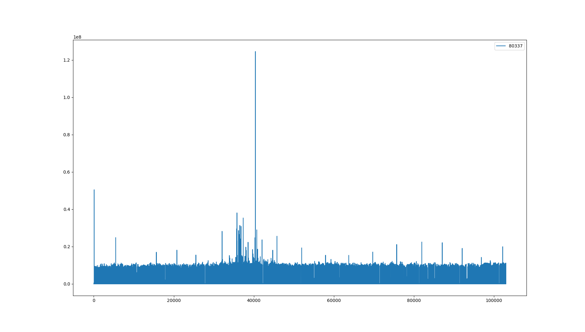
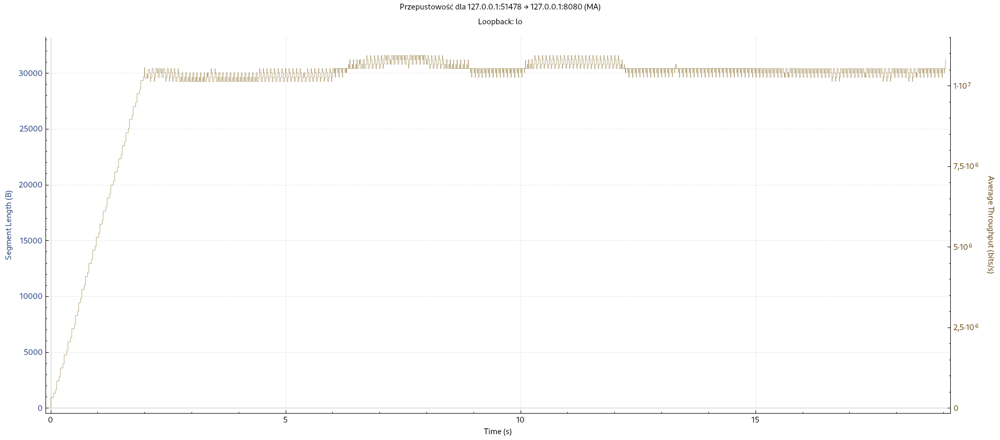

Eksperymenty zostały wykonane dla parametrów:
- czas blokady serwera: 500ms
- bufor nadawczy klienta: 1024B, 4096B, 10240B

## Wykresy

### Bufor 1024

### Bufor 4096

### Bufor 10240

## Wnioski

- w czasach wysłania występują piki, które świadczą o momencie przepełnienia bufora i konieczności zablokowania klienta
- dla małych wartości na osi OX można zaobserować brak pików - jest to moment w którym serwer i klient przetwarzali dane bez przestojów, bufory oby nie były jeszcze przepełnione
- w raz z wzrostem wielkości bufora rosła stabilność przetwarzania serwera i mniejsze czasy blokady, oraz średnia przepustowość